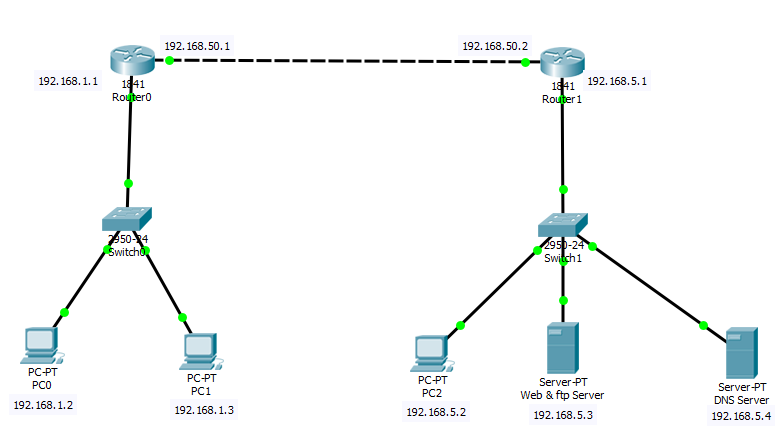
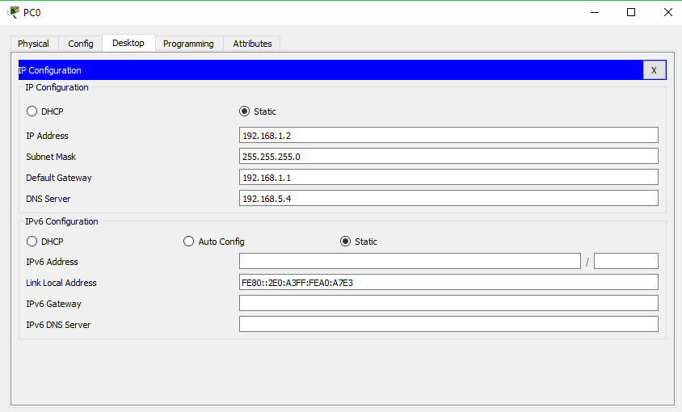
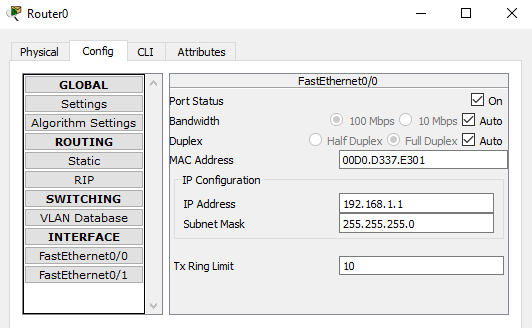
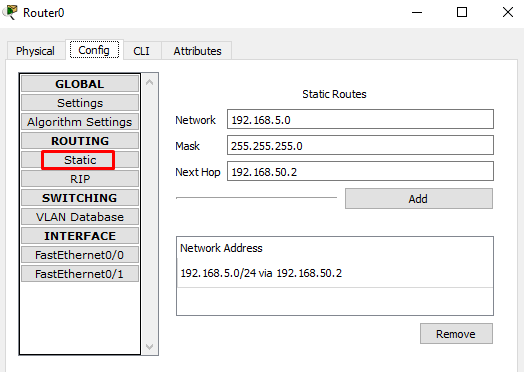
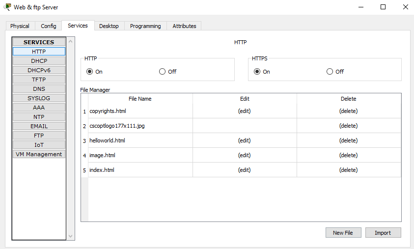
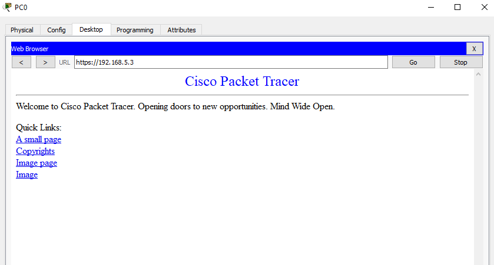
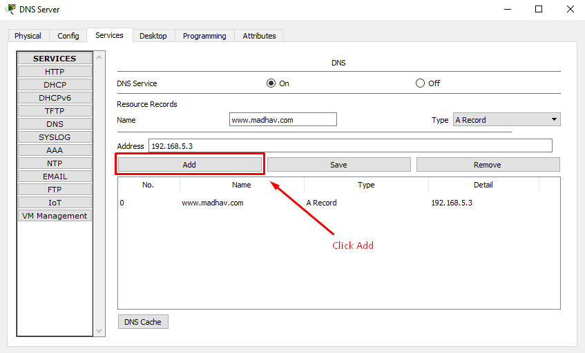
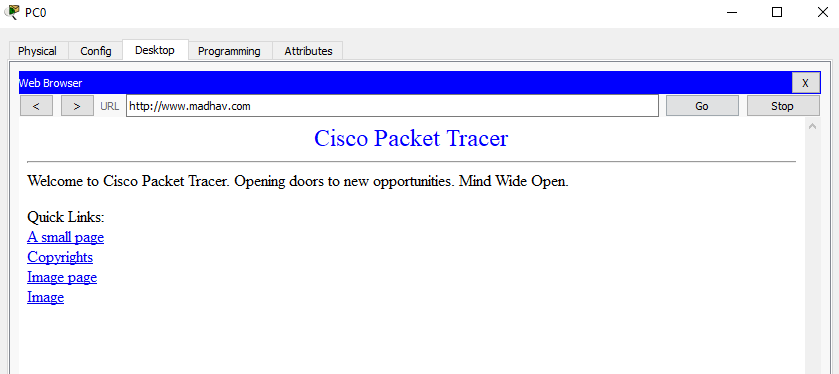

<i>fig. Simple network with DNS and FTP server</i>

We should use copper cross-over cable(dotted lines) to connect from router to router and copper straight-through cable(smooth line) to connect from router to switch and switch to end devices.

Here we are assuming the ip addresses as given in the figure above.

# IP configuration:
We are configuring all the static ip. An example for PC0 is given in the figure below.

**PC0** 
IP address: `192.168.1.2`  
Subnet Mask: `255.255.255.0`  
Default Gateway: `192.168.1.1`  
DNS Server: `192.168.5.4`

<i>fig. IP configuration for PC0</i>

In the same way, you can configure IP of all end devices as:

**PC1** 
IP address: `192.168.1.3`  
Subnet Mask: `255.255.255.0`  
Default Gateway: `192.168.1.1`  
DNS Server: `192.168.5.4`

**PC2** 
IP address: `192.168.5.2`  
Subnet Mask: `255.255.255.0`  
Default Gateway: `192.168.5.1`  
DNS Server: `192.168.5.4`

**Web and FTP server** 
IP address: `192.168.5.3`  
Subnet Mask: `255.255.255.0`  
Default Gateway: `192.168.5.1`  

**DNS Server** 
IP address: `192.168.5.4`  
Subnet Mask: `255.255.255.0`  
Default Gateway: `192.168.5.1`  

Make sure that we have not write DNS server to the Web, FTP and DNS server.

# For Router

**Router0 To Switch0** 
Ip address: `192.168.1.1`  
Subnet Mask: `255.255.255.0` 

*fig. An example figure for IP configuration of Router0 To Switch0*

**Router0 To Router1** 
Ip address: `192.168.50.1`  
Subnet Mask: `255.255.255.0`

**Router1 To Switch1** 
Ip address: `192.168.5.1`  
Subnet Mask: `255.255.255.0`

**Router1 To Router0** 
Ip address: `192.168.50.2`  
Subnet Mask: `255.255.255.0`

For the network to communicate for different network, we have to set static routes at router. We can do that by clicking on the router and from the `config` option select `static`, and then configure as follows:

**Static Route for Router0** 
Network: `192.168.5.0` 
Mask: `255.255.255.0` 
Next Hop: `192.168.50.2` 
And then click `Add`

*fig. Static Routes for Router0*

**Static Route for Router1**  
Network: `192.168.1.0` 
Mask: `255.255.255.0` 
Next Hop: `192.168.50.1` 
And then click `Add`

Now our network is complete. It's time to test and enjoy.

Let us check the files at web server. When we click `web server` and click `services`, we see that:

<i>fig. Web Server files</i>

Now, browse it from PC0. Click on PC0 and browse `https://192.168.5.3`, you will get the page like following:

<i>fig. Web browing from PC0 using IP address</i>

If we want to browse files using custom domain. We have to configure custom domain to point to web server at DNS server. Here, I am using `www.madhav.com` *(You can use your desired domain)*
To do that follow the steps below:
* Click on `DNS server`
* Click `DNS` from the `services` option
* Turn on `DNS Service`
* On `Resource Records`:- Name: `www.madhav.com`, Type: `A Record`, Address: `192.168.5.3`

<i>fig. DNS Configuration</i>

Now, browse `http://www.madhav.com`, your site is now working.

<i>fig. Web browing from PC0 using custom domain</i>

